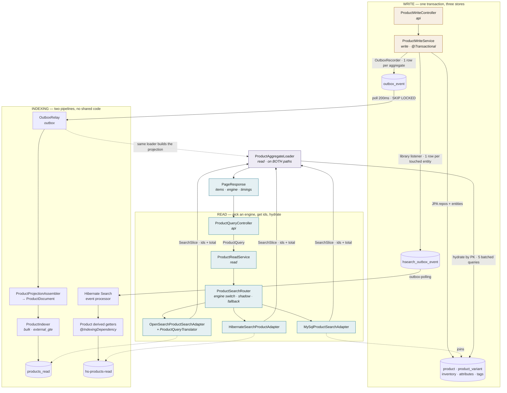

# Flow: which class does what

The same map as [`catalog-flow.html`](catalog-flow.html), in a form that renders in a
pull request. Published version:
https://claude.ai/code/artifact/cb690657-af90-4923-a1a9-ec939d7a0f02

**No arrow runs from the write path to an index.** That absence is the design: a search
outage cannot fail a POST, because the write never waited on one.

`ProductAggregateLoader` appears once and is called twice — by the relay to build the
projection, and by the read path to hydrate the page. One definition of an aggregate's
shape, so a document cannot quietly disagree with a response.
